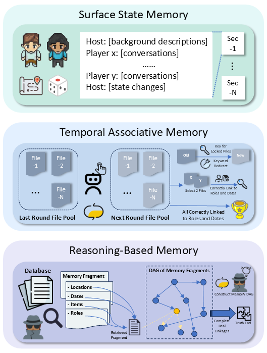
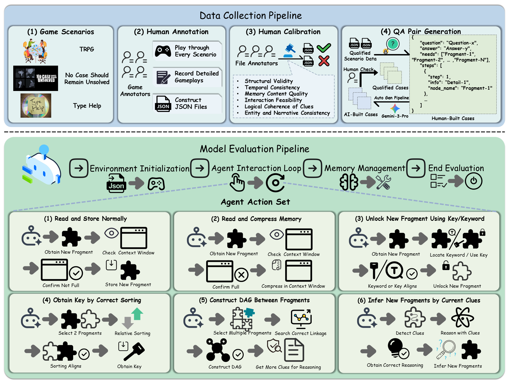
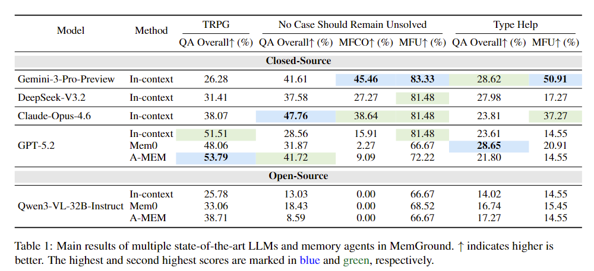
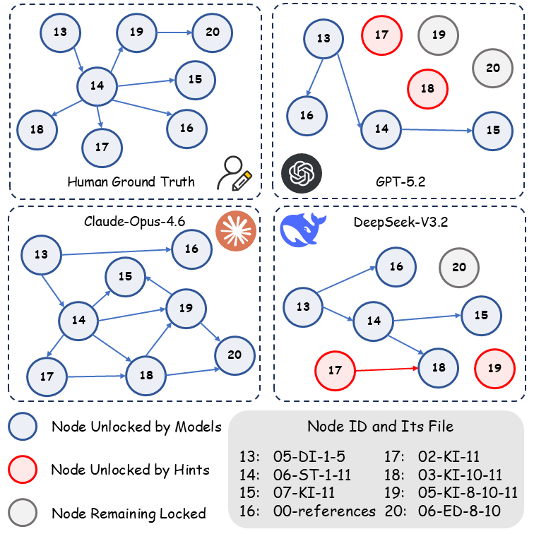

# MemGround

## Abstract

Current evaluations of long-term memory in LLMs are fundamentally static. By fixating on simple retrieval and short-context inference, they neglect the multifaceted nature of complex memory systems, such as dynamic state tracking and hierarchical reasoning in continuous interactions. To overcome these limitations, we propose MemGround, a rigorous long-term memory benchmark natively grounded in rich, gamified interactive scenarios. To systematically assess these capabilities, MemGround introduces a three-tier hierarchical framework that evaluates Surface State Memory, Temporal Associative Memory, and Reasoning-Based Memory through specialized interactive tasks. Furthermore, to comprehensively quantify both memory utilization and behavioral trajectories, we propose a multi-dimensional metric suite comprising Question-Answer Score (QA Overall), Memory Fragments Unlocked (MFU), Memory Fragments with Correct Order (MFCO), and Exploration Trajectory Diagrams (ETD). Extensive experiments reveal that state-of-the-art LLMs and memory agents still struggle with sustained dynamic tracking, temporal event association, and complex reasoning derived from long-term accumulated evidence in interactive environments.



## Method

Model evaluation is conducted through a modular interactive framework, which simulates dynamic gameplay between models and the game environment.
The system architecture is designed to separate environment logic, agent policy, memory mechanisms, and logging utilities, ensuring reproducibility and extensibility. At a high level, the evaluation process is constructed as:



## Results

(1) QA Overall, MFCO, MFU results



(2) ETD results



## Installation

Requirement: Python 3.9+

```bash
git clone https://github.com/MorleyOlsen/MemGround.git
cd MemGround
pip install -r requirements.txt

# (Optional, recommended) Install vector retrieval dependency
pip install faiss-cpu
```

## Quick Start

### Step 1: Configure API Keys

Edit `config.yaml` and fill in the API information for the LLM, judge LLM, and embedding model (OpenAI-compatible endpoints are supported):

```yaml
llm:
  api_key: "YOUR_API_KEY_HERE"
  base_url: "https://api.openai.com/v1"
  model: "gpt-4o"
  temperature: 0.2
  max_output_tokens: 600

judge_llm:
  api_key: "YOUR_JUDGE_API_KEY_HERE"  # Can be the same as the above
  base_url: "https://api.openai.com/v1"
  model: "gpt-4o"
  temperature: 0.0

embedding:
  api_key: "YOUR_EMBEDDING_API_KEY_HERE"
  model: "text-embedding-3-small"
  dim: 1536
  use_real: true
```

⚠️ Note: `config.yaml` contains secrets and should be added to `.gitignore`.

### Step 2: Select Game Type

In `config.yaml`, uncomment and configure one game type (keep only one `env` block):

```yaml
# Option 1: Type Help (File System Puzzle)
env:
  game_type: "type_help"
  scenes_path: "dataset/type_help-en/nodes.json"
  start_node_id: "Background"
  test_language: "en"
  enable_hint: true
  hint_failure_threshold: 50

# Option 2: No Case Should Remain Unsolved (Mystery Investigation)
# env:
#   game_type: "no_case_should_remain_unsolved"
#   scenes_path: "dataset/no_case_should_remain_unsolved-en/data/nodes.json"
#   start_node_id: "start"
#   test_language: "en"

# Option 3: TRPG (Tabletop Role-Playing Game)
# env:
#   game_type: "trpg"
#   trpg:
#     story_name: "Terror_on_the_Orient_Express"
#     data_dir: "dataset/trpg_en/data"
#     qa_dir: "dataset/trpg_en/qa"
#     test_language: "en"
```

### Step 3: Run the Agent

```bash
python memground_agent.py
```

Optional CLI arguments (override config):

```bash
python memground_agent.py \
  --config config.yaml \
  --retriever vector \  # Retrieval method: vector/keyword
  --top_k 5 \           # Number of memories retrieved per step
  --max_steps 200 \     # Maximum game steps
  --verbose             # Enable detailed output
```

## Key Outputs

All run logs and results are saved in the `logs/` directory, with each session having an independent subdirectory containing:

- `game_log.json`: Full step-by-step log
- `results.json`: Automatic QA evaluation results
- `checkpoints/`: Run checkpoints (for resuming)

## Resuming a Run

If a run is interrupted, configure the checkpoint path in `config.yaml` to resume:

```yaml
checkpoint:
  enabled: true
  resume_from: "logs/type_help/xxx/checkpoints/step_000200.json"
```

## License

This project is released under the [MIT License](LICENSE).

## Citation

If you find this work useful, please consider cite our paper:

```
@misc{ding2026memgroundlongtermmemoryevaluation,
      title={MemGround: Long-Term Memory Evaluation Kit for Large Language Models in Gamified Scenarios}, 
      author={Yihang Ding and Wanke Xia and Yiting Zhao and Jinbo Su and Jialiang Yang and Zhengbo Zhang and Ke Wang and Wenming Yang},
      year={2026},
      eprint={2604.14158},
      archivePrefix={arXiv},
      primaryClass={cs.CL},
      url={https://arxiv.org/abs/2604.14158}, 
}
```
